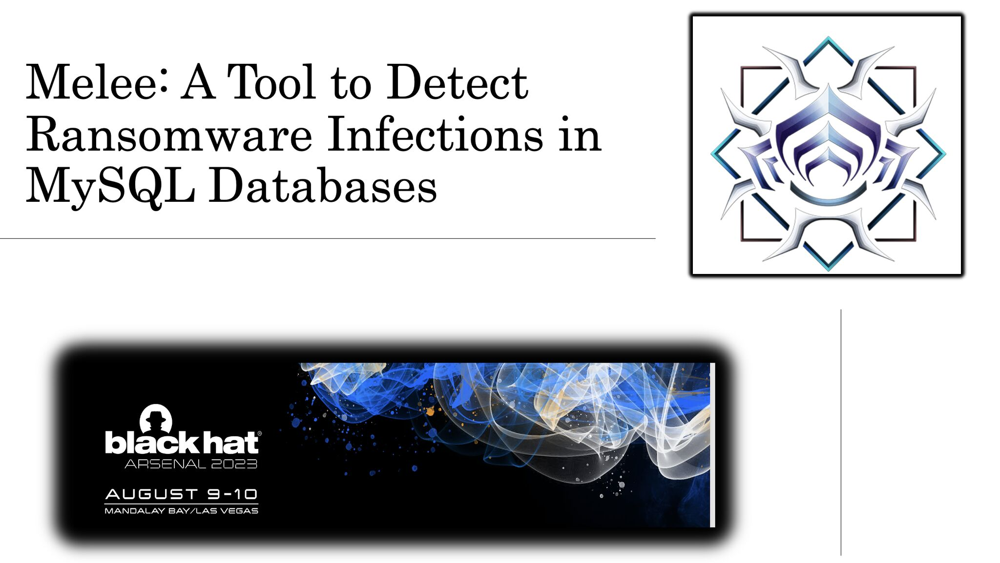

______________________________________________________________________________________________________________________

## MELEE: A Tool to Detect Ransomware Infections in MySQL Instances

Attackers are abusing MySQL instances for conducting nefarious operations on the Internet. The cybercriminals are targeting exposed MySQL instances and triggering infections at scale to exfiltrate data, destruct data, and extort money via ransom. For example one of the significant threats MySQL deployments face is ransomware. We have authored a tool named "MELEE" to detect potential infections in MySQL instances. The tool allows security researchers, penetration testers, and threat intelligence experts to detect compromised and infected MySQL instances running malicious code. The tool also enables you to conduct efficient research in the field of malware targeting cloud databases. In this release of the tool, the following modules are supported:

* MySQL instance information gathering and reconnaissance
* MySQL instance exposure to the Internet
* MySQL access permissions for assessing remote command execution
* MySQL user enumeration
* MySQL ransomware infections
* Basic assessment checks for detecting ransomware infections
* Extensive assessment checks for extracting insidious details about potential ransomware infections
* MySQL ransomware detection and scanning for both unauthenticated and authenticated deployments

--------------

## Tool Usage

$ python3 melee.py 
	--------------------------------------------------------------------

            __  ___________    ____________
           /  |/  / ____/ /   / ____/ ____/
          / /|_/ / __/ / /   / __/ / __/   
         / /  / / /___/ /___/ /___/ /___   
        /_/  /_/_____/_____/_____/_____/   
                                   

    MELEE (may-lay) : A Tool to Detect Potential Infections in MySQL Deployments !
        Authored by: Aditya K Sood {https://adityaksood.com} 
        
	--------------------------------------------------------------------

[*] { MELEE } Tool Usage:

[*] { MELEE } - MySQLDB Ransomware Infection Detector .....

[*] usage: melee.py  <mysql host (local or remote)> <mysql service port> <mysql username> <mysql password> <module>
[*] MELEE supported modules:
     - map_mysql_geoip: map the geoip presence of the MySQL host
     - check_anonymous_access: verify iif the remote MySQL host has anonymous access
     - enum_mysql_db_names: enumerate all the available MySQL databases
     - enum_mysql_db_tables: enumerate all the tables in active databases
     - enum_mysql_db_users: enumerate all the user names related to mysql database (mysql.user) only
     - enum_active_users: enumerate all the logged-in users (information_schema.processlist) only
     - check_ransomware_infection: detect potential ransomware infection
     - deep_scan_ransomware_infection: launch deep scan to extract infected resources and ransom message

[*] example: melee.py 99.34.123.xxx 3306 root root check_ransomware_infection
[*] example: melee.py 89.34.451.xxx 3306 root "" deep_scan_ransomware_infection

[*] tool considerations:
     - for ransom message analysis, file is dumped to local directory with <mysql_host>_ransom_message.txt
     - for anonymous access module, do not supply any password with username
     - for weak authentication credentials, use combinations as root:root, or other combinations

--------------

Researched and Developed By Aditya K Sood and Rohit Bansal 

--------------
